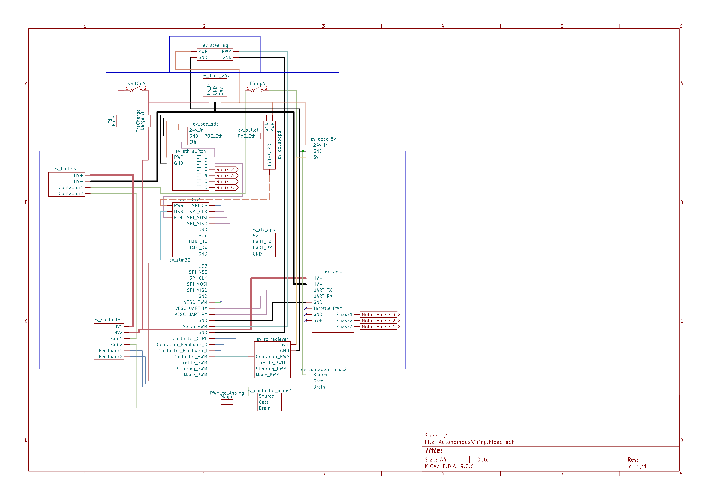

# Autonomous: Wiring

KiCad schematic showing the high level overview of the kart's wiring

## Notes

- 1 Rubik needs the camera connector (missing from the schematic)
- 1 Rubik needs the SPI <-> STM32
- 1 Rubik needs the UART <-> RTK/GPS
- STM32 will likely be powered from 3.3v and not from a USB cable
